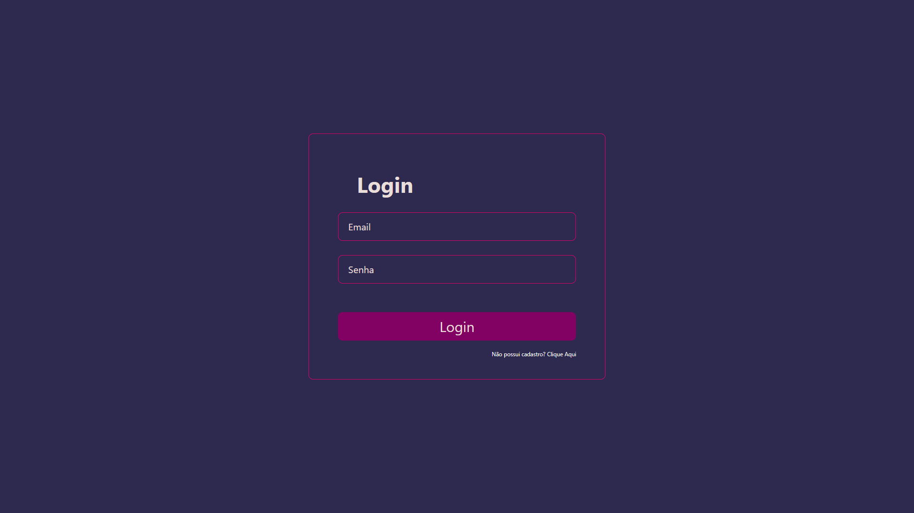

## Review Games

<div style="display:flex;align-items:center;justify-content:center;width:100%;margin:16px 0">


</div>

Projeto de estudo que empresas podem se cadastrar e adicionar jogos para mostrar a usuarios, e usuarios podem dar estrelas para cada jogo.


# Pages
* Login

* Register
* Game
* Company
* CreateGame
* CreateCompany
* Perfil

# Execução
```
cd backend
    Execute yarn ou npm i
    yarn start:dev or npm run start:dev

cd frontend
    Execute yarn ou npm i
    yarn dev ou npm run dev
```

# Author
* **Lucas Ribeiro** [LucasNetwork](https://github.com/LucasNetwork)